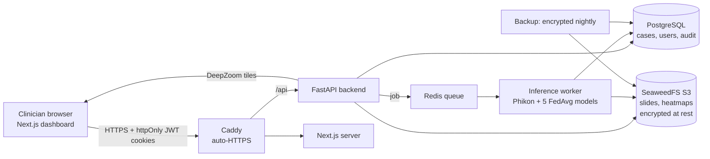

# GleasonAI - prostate biopsy AI review dashboard

A secure web application where clinicians upload an H&E prostate core-biopsy whole-slide image and get
**AI decision support** from the federated model of the BS thesis *Federated Deep Learning for Prostate Cancer
Gleason Grading via Histopathology Images and Telehealth Integration* (NUML, 2026): ISUP grade, P(cancer),
P(clinically significant cancer), attention heatmap and top tiles. A clinician confirms, amends or rejects the
result, downloads a PDF report, and every step is recorded in a tamper-evident audit trail.

> **AI decision support only. Final diagnosis requires a pathologist.** Research prototype, not a medical device.


## Architecture



The slide never leaves the server that runs the model: the browser only receives viewer tiles and results.

| Folder | What |
|---|---|
| `inference/` | `prostate_infer` - the thesis pipeline (nb01 tiling + Phikon, nb02 GatedABMIL, nb03 seed ensemble), sha256-verified model assets, CLI |
| `backend/` | FastAPI API, RQ worker, Alembic migrations, audit, reports, tests |
| `frontend/` | Next.js 15 dashboard (TypeScript, Tailwind, shadcn/ui, TanStack Query, OpenSeadragon), Vitest + Playwright |
| `docker/`, `docker-compose*.yml`, `Makefile` | images, production stack (Caddy, SeaweedFS, backups, monitoring), dev stacks |
| `docs/` | user guide, runbook, deployment, threat model, security checklist, model card, validation and load-test reports, API reference, demo script |
| `artifacts/` | the thesis notebooks the code is copied from |

## Quick start (laptop, CPU)

Requirements: Docker Desktop (8 GB RAM for Docker, 20 GB free disk), `make`, `openssl`.

```bash
make env                                   # .env with random secrets
make bundle THESIS_DIR="$HOME/Desktop/abdurahman FYP/v2_pipeline/submission_files"   # package the 5 FedAvg models
make fetch                                 # verify models, download Phikon once (~330 MB)
make up                                    # https://localhost
make seed-demo                             # demo accounts (password printed) + 6 demo cases
```

Open **https://localhost** (accept the local certificate) and sign in, e.g. as
`pathologist.radboud@gleasonai.demo` with the printed password. `make help` lists every command.

Real deployment (own domain, GPU, Hugging Face model repo): see [docs/deployment.md](docs/deployment.md).
To create your own administrator: `make seed-admin EMAIL=you@hospital.org HOSPITAL="Your Hospital"`.

## Features
- Role-based login (admin, pathologist, urologist) per hospital, lockout, rate limits, optional TOTP 2FA, 15-min idle timeout.
- Resumable uploads of `.tif/.tiff/.svs` up to 2 GB, validated (magic bytes, OpenSlide pyramid, optional ClamAV).
- Background prediction with live progress (queued -> tiling -> encoding n/N -> 5 models -> done).
- Case page: zoomable slide viewer with scale bar, attention heatmap overlay with opacity, 8 top-attention tiles,
  grade, probabilities with thesis thresholds, operating-point flags, low-confidence and out-of-distribution warnings.
- Review (confirm / amend / reject with mandatory comment), review history, PDF report.
- Case list with filters, sorting, pagination and CSV export; dashboard statistics.
- Append-only, hash-chained audit trail; admin user management; model card; data-subject export and erasure.
- Encrypted backups with a tested restore, retention job, weekly model-drift report, Prometheus/Grafana/Alertmanager.

## Results
| Check | Result |
|---|---|
| Web ensemble vs thesis (2,124 test slides) | csPCa AUC **0.9705**, cancer AUC **0.9935**, QWK **0.9047** - identical incl. 95 % CIs ([report](docs/validation_report.md)) |
| Tests | inference 28 (89 % coverage), backend 51 (88 %), frontend unit 18, Playwright end-to-end 4 (full clinical flow + WCAG 2.1 AA axe scans) |
| Load (20 viewers + 5 uploads) | tile p95 **36 ms**, 0 errors, time to result 19-98 s on CPU ([report](docs/loadtest/README.md)) |
| Security | pip-audit / npm audit 0 vulns, Trivy 0 fixable HIGH/CRITICAL, gitleaks clean ([checklist](docs/security_checklist.md)) |
| Backup/restore drill | all rows and 144 objects restored identically (`make restore-test`) |

## Development
```bash
make dev            # full stack with hot reload (API docs at https://localhost/api/v1/docs)
make dev-backend    # backend only on http://localhost:8000; then: cd frontend && npm run dev
make test           # inference + backend + frontend tests
make lint           # ruff, mypy, eslint, prettier, tsc
make e2e            # Playwright against the running stack (after make seed-e2e)
make openapi        # regenerate the typed frontend client
```

## Troubleshooting
| Problem | Fix |
|---|---|
| `Failed to fetch` / login does nothing | `make ps` - the `api` container must be healthy; `docker compose -f docker-compose.yml logs api`. |
| "AI worker is not ready" | models still loading (1-2 min) or `make fetch` not run: `docker compose -f docker-compose.yml logs worker`. |
| Docker "read-only file system" / builds fail | the disk is full: free space, restart Docker Desktop, `docker builder prune -f`. |
| Certificate warning | expected for `localhost`; see [runbook](docs/runbook.md#common-problems) to trust Caddy's CA. |

More in [docs/runbook.md](docs/runbook.md). Clinician instructions: [docs/user_guide.md](docs/user_guide.md).
Viva walkthrough: [docs/demo_script.md](docs/demo_script.md).

## Deviations from the build plan
- **Object storage: SeaweedFS instead of MinIO** - MinIO no longer publishes images or binaries (all registries
  return 404/410). SeaweedFS provides the same S3 API, per-bucket credentials and encryption at rest.
- **Next.js 15 instead of 14** - Next 14.2.35 has a critical unauthenticated RCE (CVE-2026-75604); only 15.5.24+/16.3.3+ fix it.
- **Models from local files by default** (`MODEL_SOURCE=local`), same sha256-manifest bundle layout as the
  Hugging Face model repo, which remains supported with `MODEL_SOURCE=hf`.
- The slide-level parity test and part B of the validation need PANDA slides, which were not available on the
  build machine; both are ready to run (`make validate PANDA_DIR=...`, `inference/tests/test_parity.py`).
