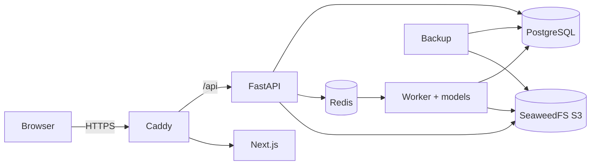

# Threat model (STRIDE)

Scope: the GleasonAI web application (Caddy, Next.js dashboard, FastAPI, RQ worker, PostgreSQL,
Redis, SeaweedFS object storage, backups). Assets, in order of sensitivity:

1. **Whole-slide images and AI results** linked to a patient pseudonym code (health data).
2. **Clinician review decisions** and the audit trail (clinical and legal record).
3. **Credentials and sessions** of clinicians and administrators.
4. **Model files** (integrity: a swapped model silently changes every diagnosis).

Trust boundaries: browser ↔ Caddy (internet), Caddy ↔ internal Docker network, API ↔ worker
(Redis queue), services ↔ storage (PostgreSQL, S3), deploy host ↔ Hugging Face (model download, once).

Legend: **M** = mitigation in the code/configuration (file), **R** = residual risk.

## 1. Slide upload (`POST /cases`, `/uploads/*`)

| STRIDE | Threat | Mitigation | Residual |
|---|---|---|---|
| S | Anonymous upload | Upload endpoints require an authenticated session and role pathologist/urologist/admin (`api/cases.py`). | - |
| T | Malicious file (polyglot, zip bomb, exploit for libtiff/OpenSlide) | Extension allow-list, TIFF/BigTIFF magic bytes, OpenSlide must open it and find >= 2 pyramid levels, optional ClamAV scan (`services/uploads.py`, `services/antivirus.py`); files stored under random UUID keys outside the web root; containers run as non-root with `no-new-privileges`. | **R:** a 0-day in OpenSlide/libtiff. Keep images patched (Trivy in CI). |
| T | Path traversal via file name | The client file name is never used for storage; keys match `^[a-z0-9_-]+(/[A-Za-z0-9_.-]+)*$` and must stay under the root (`services/storage.py`). | - |
| R | Uploader denies uploading | Audit entry `upload` with user, IP, user agent, sha256 prefix, size (hash-chained). | - |
| I | Patient identity leaked via file name / pseudonym | File names are discarded; pseudonym code format enforced, national-ID patterns (13 digits / CNIC) rejected; codes redacted from logs. | **R:** a clinician could type a name that fits the pattern - policy + training. |
| D | Disk exhaustion / huge uploads | 2 GB limit (checked before and while streaming), Caddy body limit, 30 uploads/hour/user rate limit, stale chunked uploads purged after 24 h. | **R:** many users uploading at once - monitor disk (runbook). |
| E | Uploading for another hospital | Hospital forced to the user's own unless admin (`_hospital_for`). | - |

## 2. Slide tile server (`/slides/{id}.dzi`, `/slides/{id}_files/...`)

| STRIDE | Threat | Mitigation | Residual |
|---|---|---|---|
| S | Unauthenticated tile access | Session required on every tile request (cookie JWT + server-side session). | - |
| I | IDOR: guess another hospital's case id | Row-level check `visible_cases()` on every request; UUIDv4 ids; foreign cases return 404 (no existence disclosure). The per-process access cache is keyed by (user, case) and expires after 60 s; cleared on delete/erasure. | **R:** up to 60 s of access after a user's hospital changes (sessions are revoked on role/hospital change, which ends it). |
| T | Out-of-range tile coordinates / crash | Level/column/row validated against the DeepZoom pyramid -> 404. | - |
| D | Tile flood | LRU cache of open slides, JPEG q=85, `Cache-Control: private`; p95 latency 36 ms at 121 tiles/s (load test). | **R:** no per-user tile rate limit (would harm normal panning) - rely on proxy capacity. |
| I | Slides leaving the server | Only viewer tiles (JPEG) and derived results are ever sent; the original file is never downloadable. | - |

## 3. Authentication and sessions (`/auth/*`)

| STRIDE | Threat | Mitigation | Residual |
|---|---|---|---|
| S | Password guessing / credential stuffing | argon2id (OWASP parameters), 5 logins/min/IP, lockout 15 min after 5 failures, generic error message, constant-time dummy verify for unknown users. | - |
| S | Stolen session cookie | httpOnly + Secure + SameSite=strict cookies, 15-min access tokens, server-side sessions (revocable), 15-min idle timeout, HSTS. | **R:** malware on the clinician's PC. |
| S | Refresh-token theft | Rotation on every refresh; reuse of an old refresh token revokes the whole session and is audited (`token_reuse`). | - |
| S | Admin account takeover | Optional TOTP 2FA (secret AES-GCM encrypted at rest); strongly recommended for admins. | **R:** 2FA is optional - enforce by policy. |
| T | CSRF | SameSite=strict + double-submit CSRF token header on every mutation. | - |
| T | JWT forgery | HS256 with a >= 32-char random secret (startup refuses the dev default in production); `typ` claim separates access/refresh tokens. | - |
| R | Denied logins | `login`, `login_failed` (with reason), `logout`, `logout_all` audited. | - |
| I | User enumeration | Same 401 message and similar timing for unknown users and wrong passwords. | **R:** the 423 lockout message reveals that an account exists after 5 failures (accepted: helps clinicians). |
| D | Lockout abuse (lock a colleague out) | Lockout lasts 15 min; admins can unlock by re-activating the account. | Accepted. |
| E | Privilege escalation | Role checks server-side on every endpoint (`require_roles`); role/hospital change or deactivation revokes all sessions; an admin cannot demote/deactivate themselves. | - |

## 4. Review (`POST /cases/{id}/reviews`)

| STRIDE | Threat | Mitigation | Residual |
|---|---|---|---|
| S | Review under another identity | Reviewer taken from the session, never from the request body. | - |
| T | Editing/deleting a past review | Reviews are append-only (no update/delete endpoint); the latest is current; history shown. | - |
| T | Review of a result that changed | The review stores the `prediction_id` it refers to. | - |
| R | "I never approved that" | Audit entry with decision, final grade and AI grade; hash chain + PostgreSQL trigger blocking UPDATE/DELETE/TRUNCATE on `audit_log`. | - |
| E | Admin or IT staff signing off diagnoses | Only pathologists/urologists may review (admins get 403). | - |
| T | XSS via review comment | React escapes output; strict CSP (`script-src 'self'`, no inline event handlers from data); comments escaped in the PDF. | - |

## 5. Reports and exports (`report.pdf`, `export.csv`, patient export)

| STRIDE | Threat | Mitigation | Residual |
|---|---|---|---|
| I | Report of another hospital's case | Same row-level check as the case page. | - |
| I | CSV injection (formula in pseudonym) | Pseudonym codes cannot start with `=`, `+`, `-`, `@` (must start with a letter or digit). | - |
| R | Unlogged data export | `export` audit entries for PDF, CSV and data-subject exports. | - |
| T | Presenting AI output as a diagnosis | PDF shows the disclaimer on every page, "PROVISIONAL" until reviewed, model version, review history. | - |

## 6. Model supply chain

| STRIDE | Threat | Mitigation | Residual |
|---|---|---|---|
| T | Swapped/corrupted model files | sha256 manifest verified before the worker starts (refuses to start on mismatch); `model_version` = sha256(manifest + thresholds) stored with every prediction; HF revision pinned; read-only token as a Docker secret; `OFFLINE=1` after `make fetch`. | - |
| I | HF token leak | Token only in `./secrets/hf_token` (Docker secret), never in images, env or logs (`SecretStr`). | - |

## 7. Infrastructure

| Threat | Mitigation |
|---|---|
| Direct access to internal services | Only Caddy publishes ports (80/443); Postgres, Redis, S3 are internal; monitoring UIs bind to 127.0.0.1; `/metrics` blocked at the proxy; API docs disabled in production. |
| Data at rest disclosure | SeaweedFS `encryptVolumeData` (per-chunk AES); backups AES-256 (PBKDF2, 200k iterations) with a passphrase kept off the server; host disk encryption (LUKS/FileVault/BitLocker) recommended for the PostgreSQL volume (see runbook). |
| Redis abuse | `requirepass`, internal network only. |
| Vulnerable dependencies | pip-audit, npm audit, Trivy, gitleaks in CI; images rebuilt from patched bases. |
