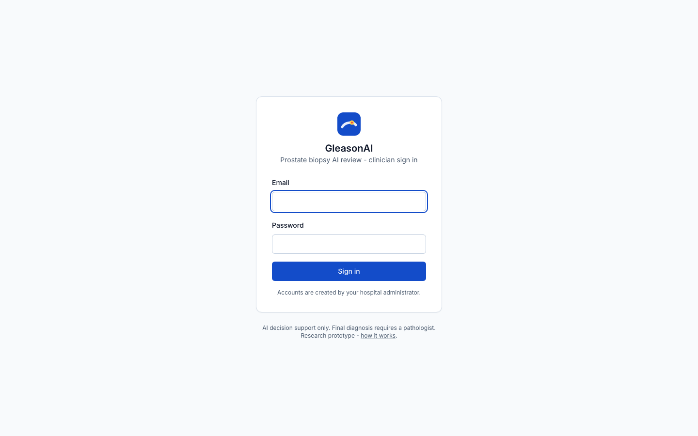
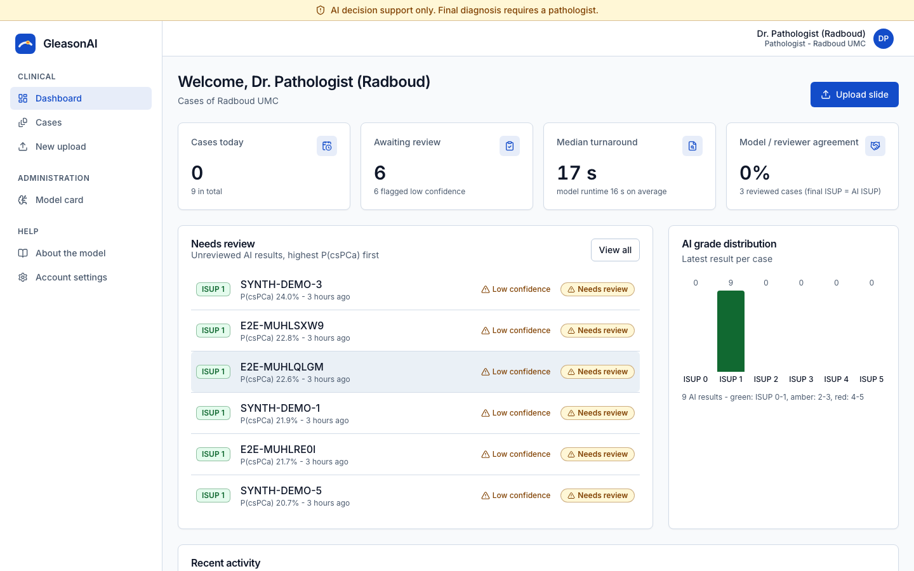
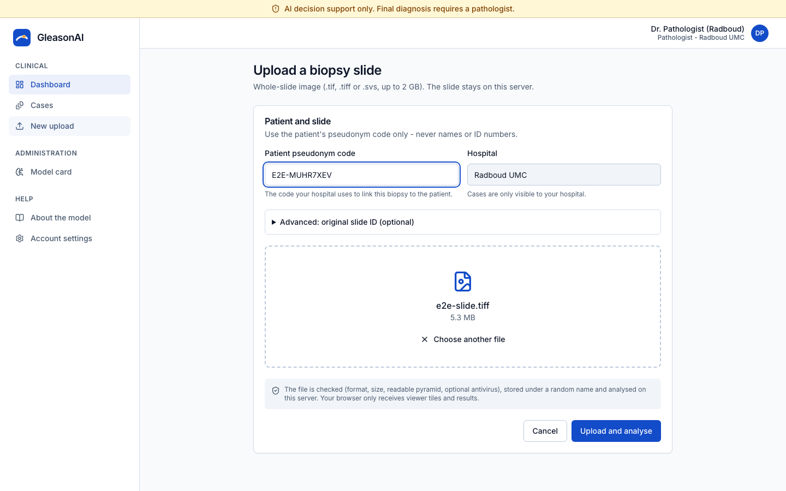
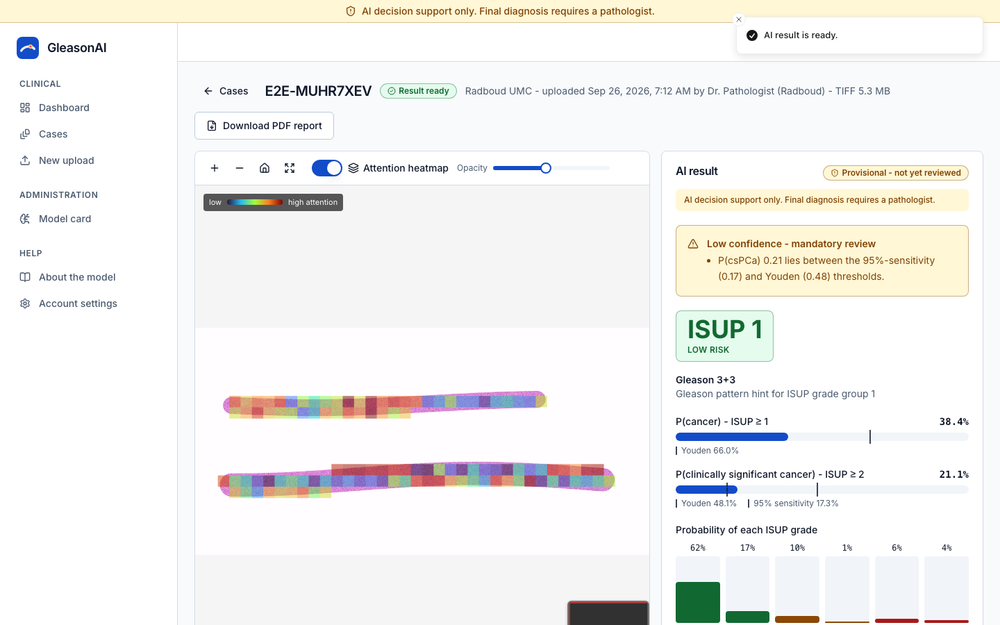
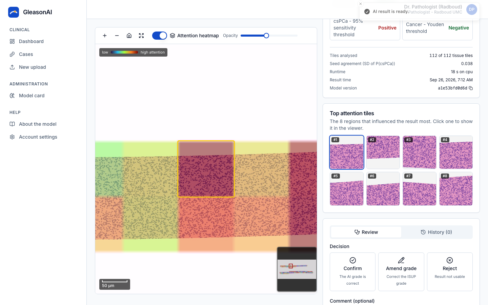
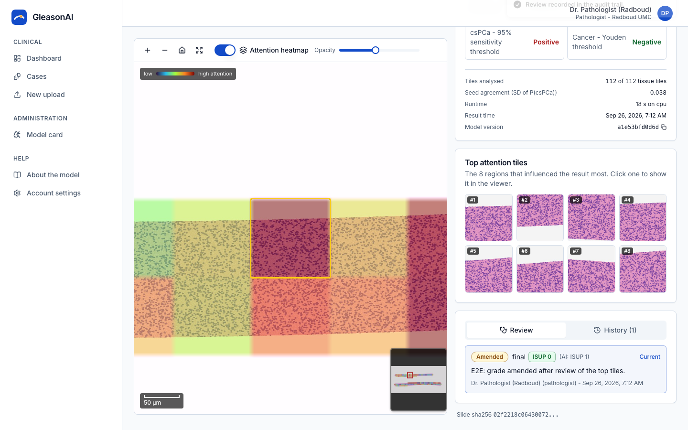
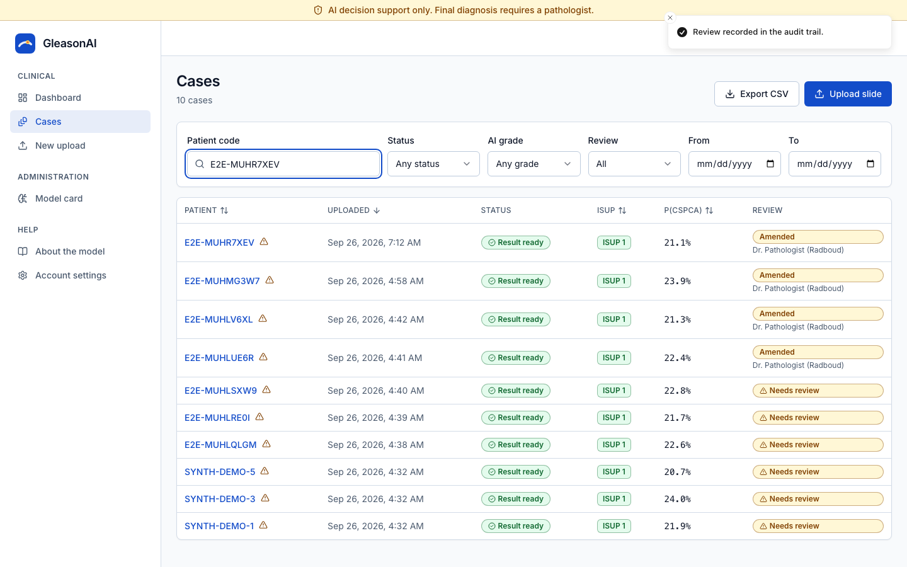
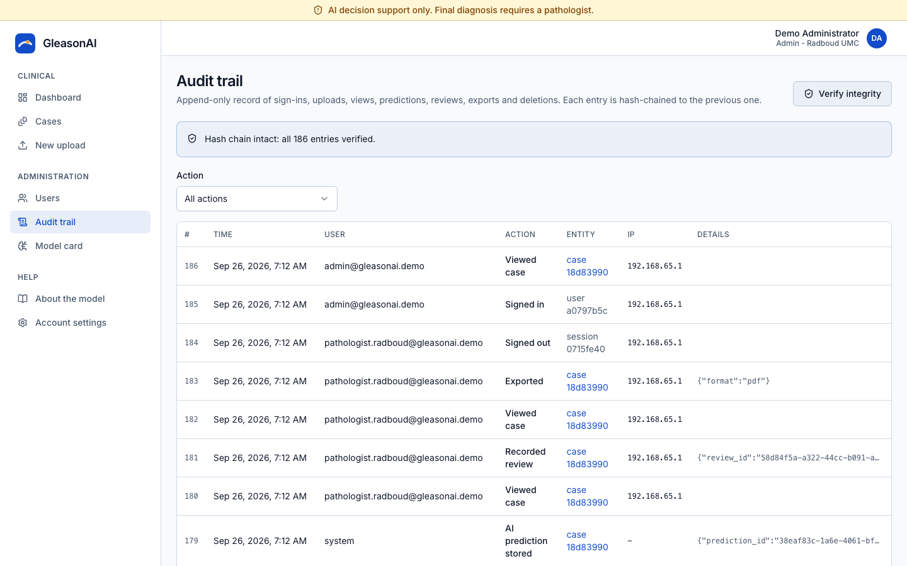

# User guide for clinicians

> **AI decision support only. Final diagnosis requires a pathologist.** Every AI result is *provisional* until
> a pathologist or urologist reviews it.

## 1. Sign in
Open the dashboard address given by your administrator and sign in with your email and password (and the
6-digit code from your authenticator app if two-factor is on). After 5 wrong passwords the account is locked for
15 minutes. You are signed out automatically after 15 minutes without activity.

## 2. Dashboard
Shows today's cases, results waiting for review (low-confidence ones are counted separately), the median time
from upload to result, how often reviewers agreed with the AI, the review queue (highest risk first) and the
distribution of AI grades. You only see the cases of your own hospital.

## 3. Upload a biopsy slide
1. **New upload** in the menu.
2. Enter the patient's **pseudonym code** (e.g. `PT-2026-0042`). Never enter a name or national ID number.
3. Drag the whole-slide image (`.tif`, `.tiff`, `.svs`, up to 2 GB) onto the box or click *Browse files*.
4. *Upload and analyse*. Large uploads continue automatically if the connection drops.

The case page opens and shows the analysis steps live: reading the slide, finding tissue, encoding tiles
(with a counter), running the 5 federated models, saving results. You can leave the page; the result is saved.

## 4. Read a result

- **ISUP grade** with its risk band (green 0-1, amber 2-3, red 4-5) and the Gleason pattern it corresponds to.
- **P(cancer)** and **P(clinically significant cancer)** with the decision thresholds marked (Youden, 95 % sensitivity).
- **Probability of each ISUP grade** - the grade uses thresholds tuned on validation data, so it can differ from
  the single most probable bar.
- **Operating points**: whether P(csPCa) is above each clinical threshold.
- **Low confidence - mandatory review** (amber box) with the reason, e.g. a probability between thresholds, few
  tissue tiles, the 5 models disagreeing, or an unusual stain.
- **Slide quality** warnings (e.g. resolution not recorded, colours outside the training data).
- Model version, number of tiles and runtime.

### The slide viewer
Zoom with the mouse wheel or the + / - buttons, drag to pan, *home* to fit the slide, *expand* for full screen.
The scale bar shows real distances. **Attention heatmap** colours the regions that influenced the result most
(red/yellow = high); switch it off or change its opacity. Click one of the **8 top attention tiles** to jump to it
(it is outlined in yellow).

## 5. Review the result (pathologists and urologists)
Choose **Confirm** (the AI grade is correct), **Amend grade** (choose the correct ISUP grade) or **Reject**
(result not usable). A comment is required when amending or rejecting. Every review is kept in the *History*
tab and in the audit trail; a newer review replaces the current decision but never deletes the old one.

## 6. PDF report
*Download PDF report* on the case page: patient code, grade, probabilities, heatmap over the slide, top tiles,
review history, model version and the disclaimer. It says **PROVISIONAL** until the case is reviewed.

## 7. Case list
*Cases*: search by patient code, filter by status, AI grade, review state (needs review, low confidence,
reviewed) and date, sort by any column, export the list as CSV.

## 8. Account settings
Change your password, turn on two-factor authentication (scan the QR code with an authenticator app), choose
light/dark mode, or sign out on all devices.

## For administrators
- **Users**: create accounts (role, hospital, initial password), change role or hospital, deactivate, reset passwords.
- **Audit trail**: every sign-in, upload, view, prediction, review, export and deletion; *Verify integrity* checks
  the hash chain. Each case also has an *Audit trail* tab.
- **Model card**: thesis results, intended use, limitations, the deployed model version and live status.

